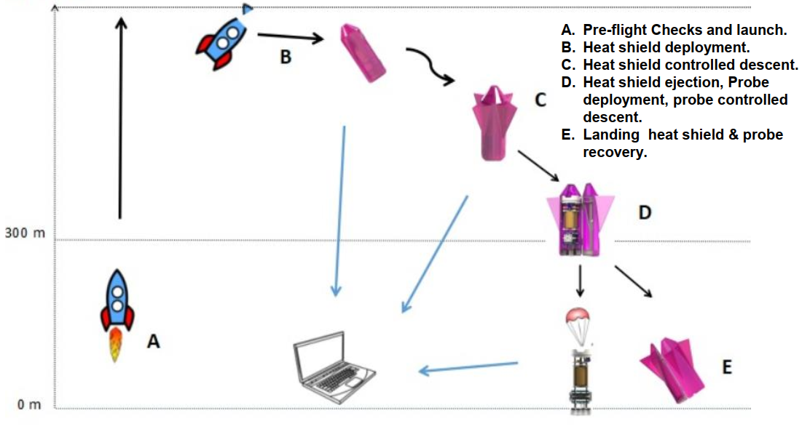
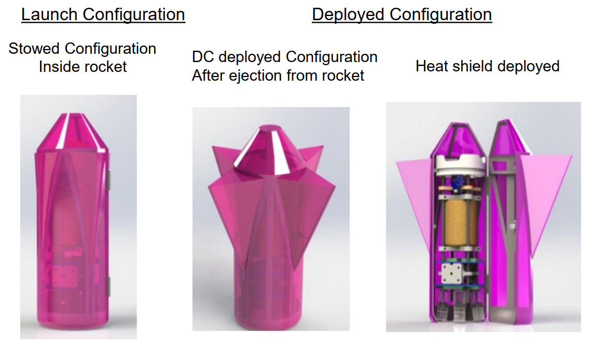
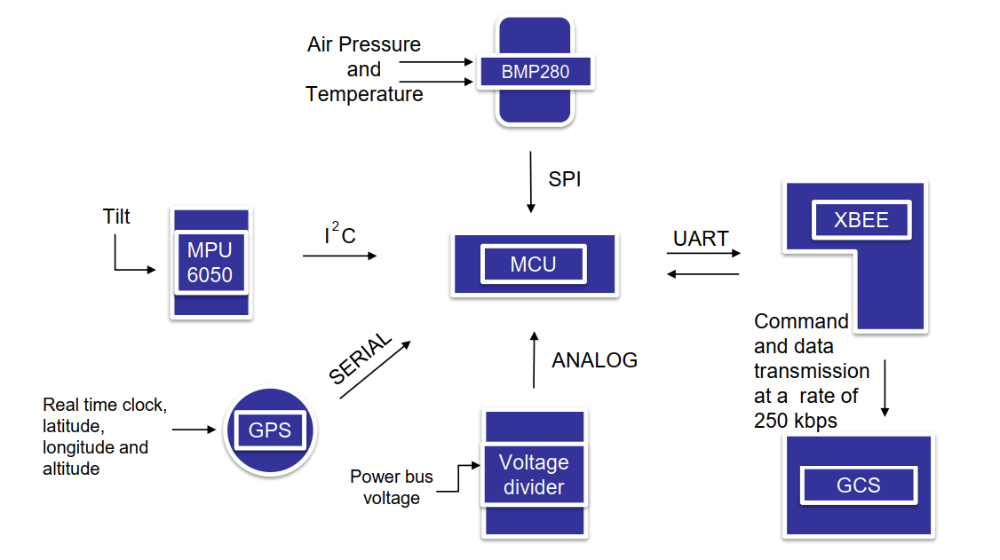
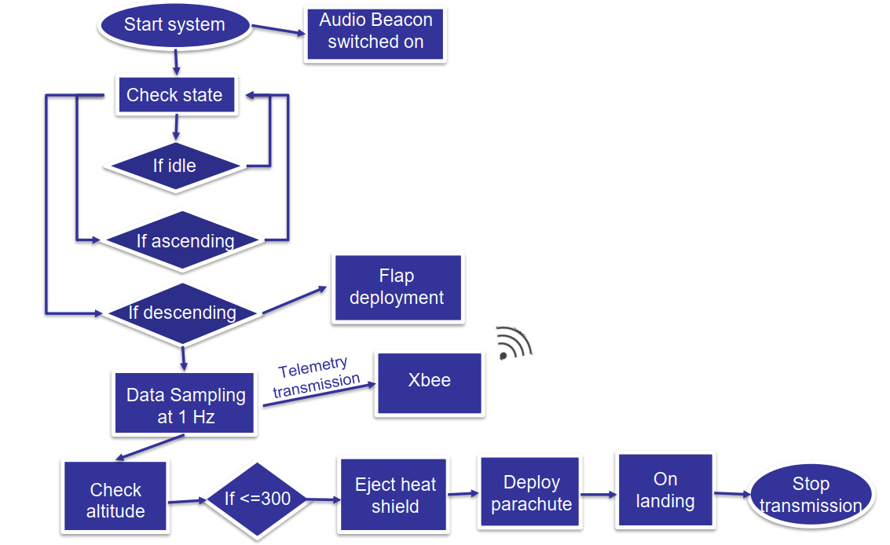

# Flight Software for the annual CanSat Competition 2018
This repository outlines the flight software developed by [Team Sammard](http://teamsammard.in/) for the [CanSat Competition](http://www.cansatcompetition.com/) 2018, an annual aerospace student design-build-launch competition organized by The [American Astronautical Society (AAS)](http://astronautical.org/) and [NASA Goddard](https://www.nasa.gov/centers/goddard/home/index.html) among others.
## Table of contents

*  [Introduction](#introduction)
*  [Design](#design)
*  [Supported models and frameworks](#supported-models-and-frameworks)
*  [Setup](#setup)
* [Prerequisites](#prerequisites)
* [Demo](#demo)
* [Additional Details](#additional-details)

## Introduction
The problem statement for the year was as follows-

**To stimulate a space probe entering a planetary atmosphere  
containing electronics, egg and a detachable heat shield**.  

 - The probe shall carry a single large hen's egg simulating a delicate sensitive scientific instrument, which must survive
   the atmospheric re-entry and the entire flight. 
   
 - The aero-braking heat shield shall protect the
   probe until deployment.
   
 - The aero-braking heat shield shall be
   released at 300 meters and the probe shall deploy a parachute.
   
 - The aero-braking heat shield shall be
   released at 300 meters and the probe shall deploy a parachute.
   
 - All structures shall survive 15Gs of launch acceleration and 30Gs of shock.
 - During descent, the probe shall transmit all telemetry
   collecting air pressure,  external temperature, GPS position and tilt
   sensor for stability verification  during descent.

*Fig 1 :  System Concept of Operations*

## Design
The probe on which the flight software is designed to be implemented is shown below :

*Fig 2 : 3D Render of the probe*

## Flight Software
The flight software was written for an Atmel ATmega328p on a nano breakout board. The basic architecture of the electronics interfaced with the microcontroller is shown below.

*Fig 3 : Electronics Overview*

The the flight software was designed to read the real-time data from the GPS, IMU, air & temperature sensor, power bus voltage sensor and output the parsed data into the Serial Bus which is transmitted to the Ground Control Station (GCS) via a Xbee S2C module at a fixed rate of 1Hz. Additionally, it also uses the gathered sensor subsystem data to determine various states of the mission, thereby deploying passive control surfaced for self-orientation during descent, ejecting the heat shield and deploying a parachute for safe landing.
The state diagram is showcased below :

*Fig 4 : State Diagram*

The Probe state is updated based on the altitude change and saved in a state variable which is stored in the EEPROM of the micro-controller and updated every second. In the  event of a processor reset due to sudden shock to the probe, the system will recover the last known state from the EEPROM memory.

## Results

The team bagged the 1st position in all of Asia-Pacific and the 18th position worldwide in its maiden effort. Pictures from the launch site can be found [here](http://www.cansatcompetition.com/photos2018.html), at the cansat competition's official website.
